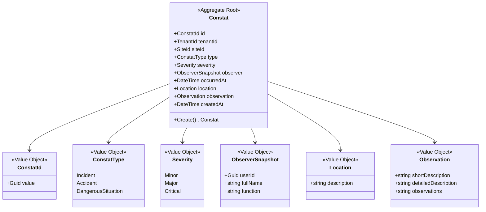

# Safety domain model — Constat aggregate

Status: frozen (paper design, pre-code)
Date: 2026-07-09
Scope: Safety bounded context, first story (Constat capture).
Refs: architecture.md (bounded contexts, event seam), ADR-ARCH-002 (CorrectiveActions
separate), ADR-ARCH-004 (Membership deferred), ADR-ARCH-005 (write path), naming.md
(id convention), session 011.

This is the DDD model. It is derived from the business language, NOT from the
Innov_Boost table nor from the HTTP DTO. The feature-level field spec lives under
context/product/specifications/safety/constat.md; this file owns the domain shape.

---

## 1. Ubiquitous language

A Constat is a safety observation made on a site, at a point in time, by an
identified person. It is a fact (a finding). It MAY later trigger a treatment
process — but that treatment is not part of the constat. A constat is recorded and
kept faithful to the moment it happened; it is not "resolved" inside Safety.

## 2. Aggregate boundary

Constat is the aggregate root of the Safety bounded context.

Its responsibility:
- capture a coherent safety observation,
- guarantee the observation's internal consistency (invariants),
- preserve it faithfully over time (proof value).

NOT its responsibility (and forbidden inside the aggregate):
- assignment, deadline, corrective status, validation, closure -> CorrectiveActions
  (ADR-ARCH-002), reached later via an integration event.
- binary media (photo/video/pdf storage, upload, compression) -> Media context,
  referenced by id, never embedded.
- reminders / critical alerts -> Notifications, event-driven.
- user-belongs-to-site authorization -> Membership (ADR-ARCH-004, Story B #20).

## 3. Aggregate and Value Objects



Value Objects:
- ConstatId / TenantId / SiteId — strongly-typed id wrappers (`readonly record struct
  ConstatId(Guid Value)`). Value is a client-generated UUIDv7 (section 6).
- ConstatType — closed set: Incident, Accident, DangerousSituation. Modeled as a VO
  (not an open string), so it can carry behavior/localization later without an API break.
- Severity — closed set: Minor, Major, Critical. Standalone VO. NOT a placeholder for a
  future Severity x Probability risk matrix (explicitly rejected, section 9).
- ObserverSnapshot — userId (the reference, for future relations/rights) plus fullName
  and optional function, FROZEN at creation. The constat is a proof: it must answer
  "who reported this risk?" faithfully even after the person changes role or leaves.
- Location — free-text description in this story. Coordinates are a future extension
  (section 9), not modeled now.
- Observation — shortDescription (required), optional detailedDescription, optional
  observations. Groups the narrative fields.

## 4. Invariants (enforced by the factory, not settable afterwards)

- siteId required (a constat is intrinsically attached to a chantier).
- tenantId required.
- type required.
- severity required.
- observer required (derived from the authenticated identity — see section 5).
- Observation.shortDescription non-empty (a constat with no observation does not exist).
- occurredAt required, immutable, and `occurredAt <= createdAt + clock-drift tolerance`
  (NOT `<= now`): a slightly-fast field device must not have its capture rejected at
  sync time. Deterministic, server-evaluated, offline-replay-safe.

All invariants are deterministic and offline-verifiable. Rules requiring server-side or
cross-context state (e.g. "the responsable exists", "the site is open") are NOT constat
invariants — they belong to other workflows. Minimal is a criterion, not a quota: the
aggregate never surrenders an invariant it can check on its own (ADR-ARCH-005).

## 5. Creation

Single entry point — a business factory, never a public constructor:

```
Constat.Create(
    ConstatId id,
    TenantId tenantId,
    SiteId siteId,
    ConstatType type,
    Severity severity,
    ObserverSnapshot observer,
    DateTime occurredAt,
    Location location,
    Observation observation)
```

HTTP contract stays decoupled from the domain:
`CreateConstatRequest` (DTO) -> `CreateConstatCommand` -> handler -> `Constat.Create()`.
The aggregate is never bound directly to the HTTP body. Slice layout mirrors the
existing vertical-slice convention: `Features/CreateConstat/` (request, command,
handler, result, errors).

Trust boundaries at creation:
- observer is derived from the JWT identity, never taken from the body.
- siteId comes from the request payload (business data, persisted, historical), NOT from
  a request-context header — an offline replay batch may carry constats captured under
  different current sites. It is validated against the tenant's site catalogue
  (ISiteScopeProvider from Story A). This is site-belongs-to-tenant only, NOT
  user-belongs-to-site (Membership, Story B #20).

## 6. Identity convention (cross-cutting)

All aggregates use a client-generated UUIDv7, wrapped in a strongly-typed id VO.
- UUIDv7: time-ordered -> B-tree index locality on append-heavy tables, free
  chronological sort; native in .NET 10 (Guid.CreateVersion7, RFC 9562); native Postgres
  uuid; generatable client-side in JS.
- The client-generated id is the idempotency key: a replayed create carries the same id,
  the server returns the existing resource (200), never 409. No separate Idempotency-Key.
- To validate at persistence wiring (not blockers): .NET's v7 has no intra-ms monotonic
  counter and an endianness representation quirk — verify the Npgsql Guid->uuid mapping
  preserves order; the offline client needs a uuidv7 JS generator (not only .NET).

Recorded in naming.md as the project-wide id convention.

## 7. Time semantics

Two distinct timestamps, never conflated:
- occurredAt — business time, client-provided, the moment the safety event happened.
  Immutable. This is what dashboards, filters and QHSE KPIs read.
- createdAt — technical audit time, server-set at persistence. Never client-provided.

Reading createdAt where occurredAt is meant would skew every QHSE curve by the offline
sync lag (capture day vs sync day).

## 8. Boundaries held (architecture-test guardrails to write for the Safety module)

- anti-corrective: no Responsable / Deadline / Statut(treatment) / Validation / Closure
  field or type in Safety.
- anti-Membership: no Membership model in Safety (ADR-ARCH-004 extended).
- anti-Media-binary: no binary/file/storage type in Safety; media is referenced by id
  only, and not at all in this story.
- hexagonal: Domain references nothing (no MicroKit, no EF, no ASP.NET Core).
- no cross-context reference: Safety never references CorrectiveActions / Notifications /
  Media / Access / Site projects.
- no event emission in this story: the aggregate persists, it does not raise. The future
  seam is `SafetyConstatRaised` (name per architecture.md), introduced with the
  Safety -> CorrectiveActions slice, not here.

## 9. Deferred (documented, deliberately NOT built now)

- Status lifecycle (Recorded / Cancelled): no status field in this story — existence
  means recorded. A Cancelled state is introduced only when a real cancellation need
  exists (who may cancel, why, traceability), with its own rules. No "just in case" state.
- Evidence (attachments): when the Media context exists, the constat carries an
  `Evidence` collection of `MediaReference(mediaId, type)` — reference only, never binary.
  Name "Evidence" (photo/video/document/signature), not "Photos". Not in this story.
- Location coordinates (lat/long): added when GPS capture exists (offline client slice).
- SafetyConstatRaised emission: the Safety -> CorrectiveActions slice.
- Risk matrix (Severity x Probability / RiskLevel): explicitly NOT planned. Rejected as
  YAGNI; Severity stands alone.

## 10. This story's scope (Story 1)

Aggregate + Create factory + first product persistence (DbContext + MicroKit.Persistence)
+ POST /constats (idempotent on ConstatId) + GET read-back. Plain REST (400 on invalid).
No PowerSync client, no domain event, no Media, no status, no Membership.
