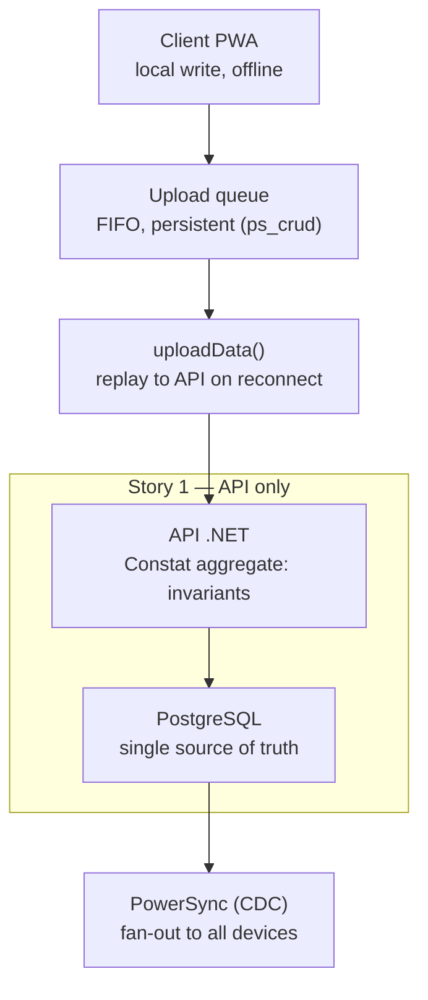

# ADR-ARCH-005 — Write path: PowerSync uploadData() to the .NET API (not direct-to-Postgres)

Status: accepted
Date: 2026-07-08

## Context

Increment 1 ships an offline PWA field client (ADR-ARCH-003). The offline
mechanism (local persistence, deferred photo upload, durability across reboot)
was proven by spike 005 (session 005). That spike used a disposable Supabase
project and a single sync rule (`SELECT * FROM constats`), with the client
writing directly to Supabase. It had NO .NET API in the loop.

The spike therefore validated the offline mechanism but did NOT decide the
production write path. It bypassed the question rather than answering it. The
question is now load-bearing because it determines whether the .NET domain
(the `Constat` aggregate and its invariants) is on the write path at all, or
only on the read/reaction side.

PowerSync separates the read path (Sync Rules + CDC, source DB -> client
SQLite) from the write path. The write path is developer-defined: every local
write is intercepted into a persistent FIFO upload queue (`ps_crud`), and the
SDK replays that queue through a developer-supplied `uploadData()` function.
`uploadData()` can either speak PostgREST directly to Supabase, or call a
custom backend API. PowerSync documents that the "bring your own backend"
design exists precisely so developers can apply server-side validation and
authorization to writes (verified against PowerSync docs, 2026-07-08:
handling-writes/writing-client-changes, configuration/app-backend/setup).

Two mutually exclusive production paths follow:

- Direct-to-Postgres: PowerSync writes to Postgres without .NET. The `Constat`
  aggregate never runs on the write path; its invariants (site required,
  severity required, frozen observer snapshot, tenant isolation) are not
  enforced at write time. The .NET domain built for Access (#4) and Site (#17)
  becomes read-only for constats, and business rules would have to be
  re-implemented client-side.
- uploadData() -> .NET API: the offline queue is replayed as write requests to
  the .NET API, which validates through the aggregate and persists. Offline UX
  is preserved (instant local write); the domain stays the single write
  authority.

## Decision

The production write path for the SaaS BTP field client is
`uploadData()` -> .NET API. **PowerSync is the transport and replication layer,
not a write authority.** The .NET domain is the single entry point for all
writes.

The API remains the only authoritative command endpoint, whether a request
originates online or from the offline replay queue. Online and offline writes
are the same command hitting the same use case and the same aggregate; offline
is only a deferral of transport, never a different write path.

This makes the CQRS split explicit for the field client:

- Command path (this ADR): Client -> API -> Domain (aggregate) -> PostgreSQL.
- Query path (per ADR-ARCH-003): Client reads from local SQLite, synced from
  PostgreSQL by PowerSync. Reads never hit the API.

Story 1 builds ONLY the API segment: the `Constat` aggregate, the write
endpoint, and read-back (GET). There is NO PowerSync client in Story 1; the
endpoint is simply the target `uploadData()` will call in a later offline
slice. The client SQLite, upload queue, uploadData() connector, and CDC
fan-out are that later slice, not this one.

Queue-safety constraint (from PowerSync's documented queue behavior): a write
validation failure MUST NOT be signalled as a queue-blocking 4xx — a blocked
queue stalls all subsequent offline writes. A 5xx stays reserved for transient
failures (source DB unavailable), which the queue safely retries. The precise
response protocol for a domain rejection (accepted-for-processing vs a
synced-back `Rejected` / `NeedsReview` status, and its HTTP semantics) is
DEFERRED to the offline client slice and the offline conflict-resolution ADR.
This ADR fixes the write PATH and the non-blocking constraint only; it does not
design the rejection protocol.

Invariant placement (minimal, NOT anemic): the aggregate keeps every invariant
that is deterministic, always true, and verifiable offline — site required,
severity required, description required, frozen observer snapshot, tenant/site
scoping. "Minimal" is a criterion, not a quota: it excludes only rules that
need server-side or cross-context state to evaluate (e.g. "the assigned
responsable exists", "the site is currently open"), which belong to other
workflows (CorrectiveActions) and would otherwise make a legitimate offline
capture fail at sync time. The domain never surrenders an invariant it can
check on its own.

## Consequences

- Easier: one write pipeline for every context (Constat, Audit, CorrectiveAction,
  Stock, Workforce) — a single way to create data, with domain invariants,
  authorization, tenant/site scoping, and domain events all server-side.
- Easier (testing): online and offline writes traverse the identical
  API -> use case -> aggregate path, so one set of domain tests covers both.
  There is no separate offline write logic to test.
- Easier: the Access (#4) and Site (#17) domain investment stays on the write
  path; nothing is re-implemented client-side.
- Constrained: clients never write authoritative state directly; all mutations
  transit the API. Optimistic local UX is provided by PowerSync's local SQLite,
  reconciled on sync.
- New requirement: the API's write endpoints must be idempotent (the queue may
  replay), keyed on a client-generated aggregate id. The id FORMAT (UUIDv7 /
  ULID / GUID) is cross-cutting across all contexts and is decided at the first
  persisted aggregate (the Constat story), recorded in naming.md — not in this
  ADR.
- Still open (not resolved here): the offline conflict-resolution strategy for
  safety data, and the domain-rejection response protocol above (future ADR).
  This ADR fixes the write PATH; conflict and rejection semantics on that path
  remain to be decided.
- Cost note (client slice, not Story 1): PowerSync Custom Write Checkpoints
  (strict post-upload consistency) are a Team/Enterprise-plan feature — to be
  weighed when the offline client is wired, not now.

## Alternatives considered

- Direct-to-Postgres via PowerSync (client writes straight to the synced DB).
  Rejected: bypasses the domain, its invariants, authorization, and domain
  events; forces business logic into the client; incoherent with the whole
  .NET/DDD/MicroKit architecture and with VISION-PRODUIT 22 (auditability,
  traceability). PowerSync does NOT impose this model — the feared "engine
  forces direct writes" case does not apply here.
- Supabase Edge Functions as the write API instead of the .NET host. Rejected
  for the core domain: it would split the write authority away from the .NET
  aggregate and duplicate domain rules outside the modular monolith. Edge
  Functions remain available for non-domain glue if a real need appears.
