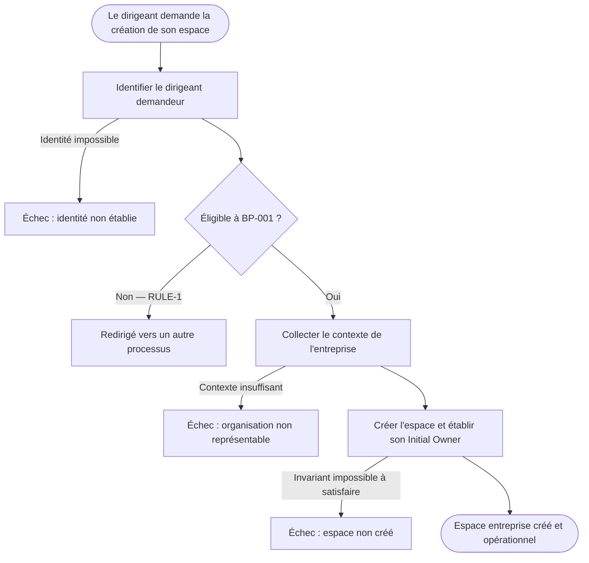

# BP-001 — Créer son espace entreprise

Status: business model locked (2026-07-15). Conceptual model only — no technical design.
Method: Process-First Design Method (steps 0-9 validated). Implementation (step 10)
and technical ADRs (step 11) are OUT of this document.

> This specification captures the BUSINESS process only. It contains no table, no
> auth provider, no API, no workflow engine. Technical mechanisms live in step-10
> design and in the ADRs it produces.

---

## Context

A company director, external to the platform, wants to obtain an operational company
workspace to start piloting their operations. This is the founding entry path into the
product: a person creating the first organization they own. It is NOT an invitation —
there is no inviter above a founder.

This process is the first exercise of the product's structural model recorded in
ADR-ARCH-012 (person -> account -> N organizations, with Ownership and Membership as
distinct relations).

---

## Frame (step 0)

| Element | Value |
|---|---|
| BP | Créer son espace entreprise |
| ACT (primary) | A company director (BTP), external to the platform |
| INT | Start using the platform to pilot their company's operations |
| TRG | The director requests the creation of their company workspace |
| Model | Self-service — no platform-side human actor within the boundary |

## Boundary (step 1)

Start: the director requests creation — no established identity, no workspace, no
ownership yet.

End (OUT): the company workspace exists, holds its initial owner, and is ready to
accommodate future platform usage.

Out of boundary (named, not handled): commercial cycle (qualification, subscription,
billing) · connecting to the workspace (a future process) · advanced business
configuration · inviting collaborators · creating the first construction site ·
operational setup · creating an additional workspace · joining an existing organization.

## Actors (step 2)

Human — the director, the only actor within the boundary: initiator, intent holder,
beneficiary. Does not execute the internal operations.

External capabilities involved within the process boundary (named only to clarify
responsibility boundaries; their technical realization is out of scope):
- Identity establishment capability: provides the recognized identity required by the
  process.
- Workspace creation capability: establishes the workspace and initial ownership.

Company information is not an actor: it is a task input.

## Tasks (steps 3-4)

### TSK-1 — Identify the requesting director
- TRG: the director requests workspace creation
- Owner: identity capability
- Preconditions: none (first task)
- Inputs: the elements needed to establish the requester's identity (business level)
- Rules: produce a recognised identity to which ownership can later be attached
- Outputs: a person identified as the author of the request
- Errors: identity cannot be established
- EVT: the requester has been identified

### TSK-2 — Collect the organization context
- TRG: the requester has been identified (OUT TSK-1)
- Owner: the onboarding process
- Preconditions: an identified requester exists
- Inputs: the elements needed to represent the concerned organization
- Rules: the context must allow a sufficiently unique representation of the organization
- Outputs: an organization context usable to create the workspace
- Errors: insufficient or incoherent context
- EVT: the organization context has been collected

### TSK-3 — Create the workspace with its owner
- TRG: the organization context has been collected (OUT TSK-2)
- Owner: provisioning capability
- Preconditions: (a) an identified requester (OUT TSK-1) · (b) a usable organization
  context (OUT TSK-2) · (c) the requester's identity is established to the level
  required to receive initial ownership
- Inputs: requester identity · organization context
- Rules / INV: exactly one initial owner at creation · an active workspace can never
  exist without an owner (creation + ownership are a single indivisible unit)
- Outputs: a declared organization (Status = Declared) · a created workspace with its
  own technical identity · initial ownership attributed to the requester
- Errors: the workspace cannot be created · initial ownership cannot be established
- EVT: the workspace has been created with its initial owner

Task chain: TSK-1 (who requests?) -> TSK-2 (for which organization?) ->
TSK-3 (what relation do we materialise?) -> OUT.

TSK-4 was removed: the state model proved there is no business transformation between
"workspace created with owner" and "workspace usable". Any intermediate technical
state belongs to implementation, not to this model.

## Business rules (step 5)

- INV-1 — A VERIFIED organization holds a single active workspace. An organization
  created by BP-001 is a DECLARED organization (Status = Declared): its strong
  uniqueness is NOT guaranteed at this stage and is established later by a separate
  verification process. What BP-001 guarantees is a workspace with its own technical
  identity, never a proof that the company is unique.
- INV-2 — At creation, a workspace has exactly one initial owner.
- INV-3 — The initial owner is the identified requester who triggered BP-001.
- INV-4 — An active workspace can never exist without an owner (whole lifetime).
- RULE-1 — BP-001 covers only initial creation by a director who does not yet own a
  workspace. Adding an organization, invitation, ownership transfer are other processes.
- RULE-2 — The requester must hold an identity established to the level required to
  become initial owner (business threshold; mechanism deferred to step 10).
- RULE-3 — The requester DECLARES the organization they represent. Validating the
  director-organization link belongs to another process if the product requires it.
- RULE-4 — A single creation intent must not produce several concurrent workspaces
  for the same organization.

The conflict of two concurrent BP-001 instances targeting the same organization is
NOT a separate rule — it is a consequence of INV-1, observable at the TSK-2 -> TSK-3
transition. Its resolution is deferred (see Deferred decisions).

### Organization identity maturity (refined at step 10, D5)

BP-001 creates a DECLARED organization, not a verified one:

    Organization
    ------------
    Id · DisplayName · Status ∈ { Declared, Verified(future) }

- BP-001 produces Organization(Status = Declared) owning one Workspace.
- The Workspace has its own technical identity, distinct from the organization's
  identity. It is never a proof of the company's uniqueness.
- The system MAY offer to join a probably-existing organization rather than create a
  new one. This is a user-journey aid, never an atomic refusal and never a uniqueness
  proof. HOW that probability is determined is an implementation concern, not part of
  this model.
- Strong organization uniqueness (INV-1 in its full sense) is introduced by a later
  verification process, which sets Status = Verified. That process is OUT of BP-001.

## Events (EVT)

| EVT | Meaning |
|---|---|
| Requester identified | The identity required by the process is established |
| Organization context collected | The declared organization is sufficiently representable |
| Workspace created with initial owner | The organization now has its operational workspace |

## State model (step 7)

Subject: the BP-001 process instance. The produced object (workspace) is verified at
transitions; its own lifecycle begins at the end of TSK-3.

    STATE: Demande initiée
       | EVT: requester identified
       v
    STATE: Demandeur identifié
       | EVT: organization context collected
       v
    STATE: Contexte recueilli
       | EVT: workspace created with initial owner
       v
    STATE: Espace créé  (terminal — success = operational)

Failure terminals (Errors): Identité impossible · Contexte insuffisant ·
Création impossible.
Out-of-boundary exit (NOT a failure): Redirigé hors BP-001 (RULE-1 not satisfied).

Invariant placement, verified:
- INV-1 becomes checkable at the Contexte recueilli -> Espace créé transition; no
  workspace exists before it. This is where the inter-instance conflict is observable.
- INV-2 / INV-3 established atomically at that same transition.
- INV-4 holds: the model contains no state where a workspace exists without an owner.
  There is no intermediate business state between "no workspace" and "workspace with
  owner".

## Conceptual diagram (step 8)

## Associated decisions (step 6)

Category A (conceptual — decided and recorded):
- ADR-ARCH-012 — Person, account, organizations and initial ownership model.
- ADR-PROD-002 — Founding creation does not verify the requester-organization legal link.

Category B (technical — identified, deferred to step 10; NO conclusion recorded here):
- D4 — Guaranteeing the initial owner is established before the workspace becomes
  active, across the identity/provisioning boundary.
- D5 — Resolving the conflict between concurrent BP-001 instances (INV-1).

## Traceability

| Business element | Source |
|---|---|
| INV-1..INV-4 | Business rules (step 5) |
| RULE-1..RULE-4 | Business rules (step 5) |
| STATE | State model (step 7) |
| EVT | Task contracts + state transitions |
| ADR-ARCH-012 | Architecture decision |
| ADR-PROD-002 | Product decision |
| D4, D5 | Deferred (Category B, step 10) |
