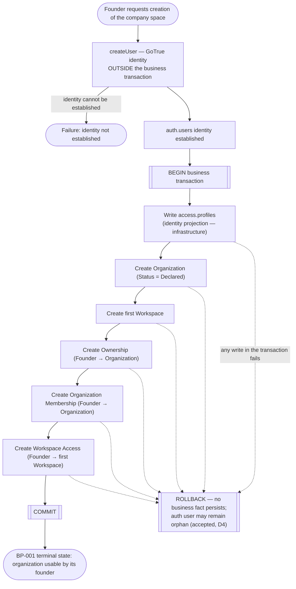
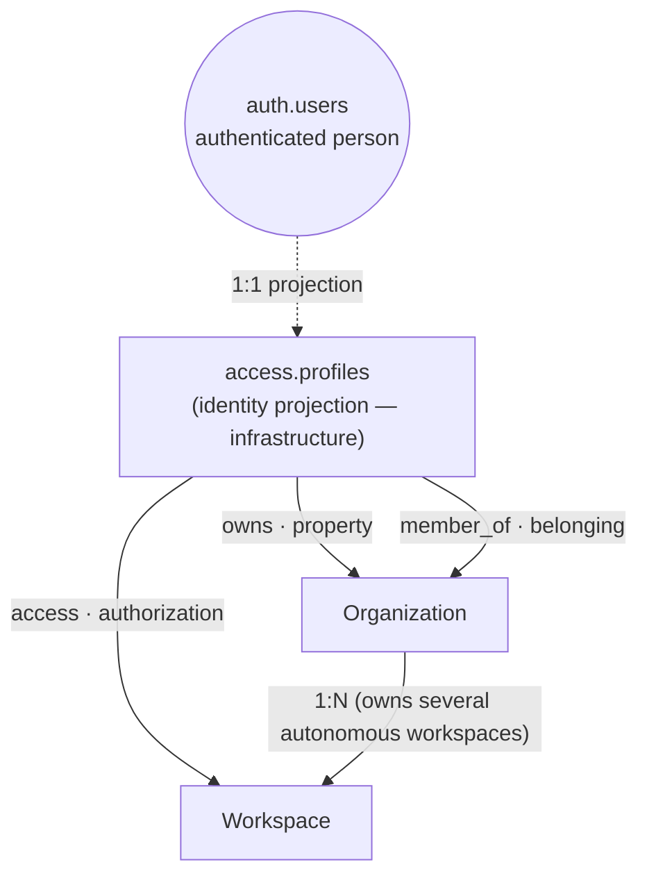
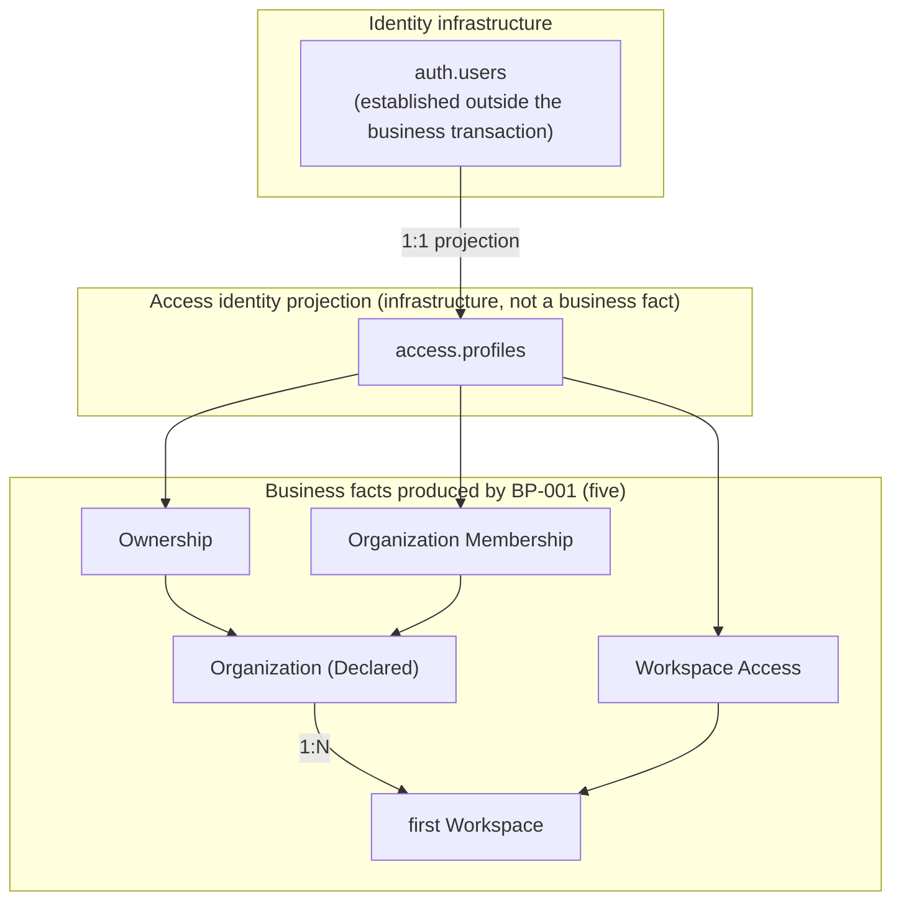
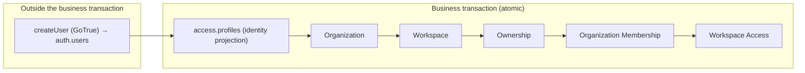
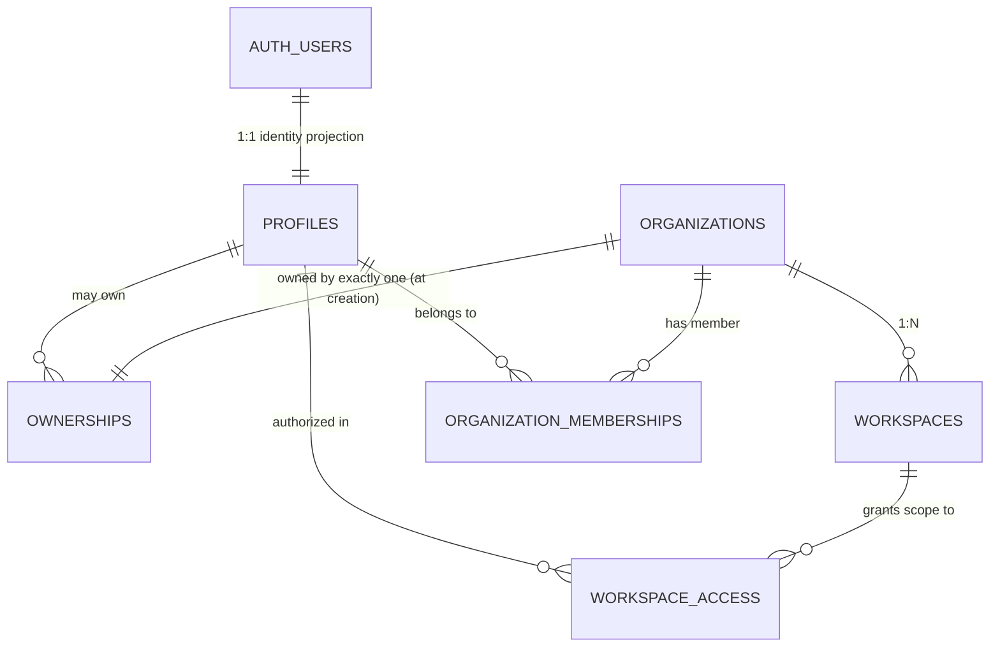

# BP-001 Design Package — Créer son espace entreprise

Status: reference model (design-complete, pre-implementation).
Purpose: the autonomous reference for BP-001. A reader who did NOT take part in the design
discussions must be able to understand BP-001 and hand it to Implementation Design without
reconstructing the reasoning from conversations.

Scope of this document: the business process, the conceptual domain model, the state/lifecycle, and
the transactional consistency of BP-001. It contains NO implementation decisions — no SQL DDL, no
`ON DELETE` strategy, no RLS policy content, no API contracts, no command/handler shapes, no physical
table names. Those belong to Implementation Design (ID-3) and the Category-B technical ADRs that
follow it. Source of the business model: the BP-001 specification; this package translates that
validated model into an explicit, implementable reference.

---

## 0. Vocabulary (self-contained)

BP-001 relates a person to an organization and a workspace through THREE distinct relations that are
never conflated, plus one identity projection that is infrastructure, not a business fact.

- **Ownership** — a PROPERTY relation. Answers "to whom does the organization belong". Not
  authorization.
- **Membership** — a BELONGING relation. Answers "who is part of the organization's human
  collective". Not authorization. Always qualified as **Organization Membership** (the word
  *membership* belongs to the belonging domain, at the Organization grain).
- **Access** — an AUTHORIZATION relation. Answers "at which scope may the person act". Always
  qualified by its scope — here, **Workspace Access**. (The word *access* belongs to the
  authorization domain.)

None of the three derives from, is calculated from, or replaces another. They may be CORRELATED by
the same process (the founder creates the organization, becomes its owner, its first member, and
gains access to its first workspace), but no correlation is a derivation. In particular:
`member_of → access` and `owns → access` are forbidden as model rules.

- **Identity projection** (`access.profiles`) — the product's projection of an authenticated person.
  It is INFRASTRUCTURE required to attach the three relations (they reference the person through this
  projection). It is NOT itself a business fact of BP-001; it is the identity foundation the business
  facts stand on.

A **scope level** (a level at which the system may authorize) is not an **access edge** (a concrete
authorization relation produced by a process). BP-001 produces one access edge, at the Workspace
level.

---

## 1. Business Process Model

**Actor.** A founder — a person creating an organization — external to the platform. Self-service —
no platform-side human actor within the boundary.

**Trigger.** The founder requests the creation of their company space.

**Precondition.** None on entry: no established identity, no organization, no workspace, no ownership,
no membership, no access.

**Terminal state (success).** The organization exists (Status = Declared) with its first workspace,
owned by the founder, of which the founder is the first member, and in which the founder is authorized
to act — ready for the founder to use the product.

### Flow



### Steps

1. **Identity establishment** — `createUser` against GoTrue. HTTP, OUTSIDE the business transaction.
   Produces an `auth.users` identity. If it fails, BP-001 fails at this step (no business state
   exists yet).
2. **Business transaction** — a single atomic unit that writes the identity projection, then the five
   business facts (order in §4). It either commits as a whole or rolls back as a whole. The terminal
   state is precisely: the identity projection PLUS the five business facts, present together — not
   six business facts (the projection is infrastructure, see §0 and §4).

### Business invariants

- **INV-1** — a Declared organization immediately owns its first active workspace (workspace
  existence does not wait for verification).
- **INV-2** — at creation, the workspace has exactly one initial owner.
- **INV-3** — the initial owner is the identified requester who triggered BP-001.
- **INV-4** — an active workspace can never exist without an owner (whole lifetime); creation and
  ownership are a single indivisible unit.
- **Ownership / Membership / Access are separate** — none is derived from another (see §0).
- **Founder Access targets the FIRST workspace specifically** — not the organization, not all its
  workspaces (Organization 1:N Workspace). Later workspaces are attributed access by a different,
  future process.

### Errors / rupture points

- Identity cannot be established (step 1) → terminal failure, no business state.
- Any write in the business transaction fails → ROLLBACK; none of the five business facts persists.
  The `auth.users` identity may remain as an orphan; this is accepted (an orphan identity is
  harmless; an orphan workspace is forbidden by INV-4).
- The identity projection (`access.profiles`) must never persist durably without the business facts
  it exists to enable — hence it lives inside the same transaction (see §4).

---

## 2. Domain Model (conceptual)

Conceptual relations only — no SQL tables. The three axes, plus the Organization 1:N Workspace
containment. `access.profiles` is shown explicitly as the identity pivot: the person is projected
into the product as a profile, and the three relations attach through that projection — it is drawn
in the graph (dashed, as infrastructure) so the identity pivot is not hidden, while remaining outside
the business-fact set.



The three axes (`owns`, `member_of`, `access`) are the business relations; `auth.users` and
`access.profiles` are the identity foundation they stand on, not business concepts of BP-001.

**Explicit rules.**

- Ownership ≠ Membership ≠ Access. Three questions, three relations: "whose is it", "who belongs",
  "where may they act".
- Membership does not implicitly produce Access. A member with no access edge can act on nothing
  operational — and that is coherent, not a defect. (The prohibition is on DERIVATION, not on future
  coexistence.)
- Ownership does not implicitly produce Access. An owner is not, by ownership alone, authorized to
  act; access is a separate relation.
- Workspace Access is an EXPLICIT relation produced by BP-001, correlated with the founder's creation
  but not derived from Ownership.
- An Organization holds 1:N Workspaces (a domain fact: autonomous operational spaces — agencies,
  activities, entities — whose teams do not necessarily see the same data).
- The identity projection (`access.profiles`) is infrastructure, not a business concept of BP-001: it
  is the foundation the three relations attach through, shown dashed in the diagram above.

---

## 3. State / Lifecycle Model

Three layers, kept distinct: identity infrastructure, the access identity projection, and the
business facts.

### Before BP-001

```
Identity infrastructure   : the person may exist as an authenticated identity, or not yet.
Access identity projection: none.
Business facts            : no Organization, no Workspace, no Ownership,
                            no Organization Membership, no Workspace Access.
```

### After BP-001 (success)



**Reading.** The founder is, at the terminal state: the OWNER of the organization, its first MEMBER,
and AUTHORIZED to act in its first workspace — three distinct facts, on three distinct axes, none
derived from another. The organization is Declared (not Verified — verification is a separate,
out-of-boundary process). The identity projection (`access.profiles`) underlies the three relations
but is not counted among the business facts.

---

## 4. Transaction & Consistency Model

### Boundary



The switch point is the COMMIT of the business transaction. Before it, nothing durable exists at the
business level; after it, all five business facts exist together.

### Order (conceptual / FK dependency — NOT an execution rule)

The order below expresses CONCEPTUAL / referential dependency — each relation references identities or
entities that must exist for the reference to be valid. It is not a mandated physical execution
sequence: within one atomic transaction the exact write order is an Implementation-Design concern
(there is no partial state to protect between writes). It is stated so that a reader sees why the
dependencies point the way they do.

```
access.profiles          (identity projection — the anchor the three relations reference)
        ↓
Organization             (a root entity; nothing upstream depends on)
        ↓
Workspace                (references Organization)
        ↓
Ownership                (references Profile + Organization)
        ↓
Organization Membership  (references Profile + Organization)
        ↓
Workspace Access         (references Profile + Workspace)
```

- `access.profiles` comes first among the writes because Ownership, Organization Membership and
  Workspace Access all reference the person through it.
- `Organization` and `access.profiles` are the two dependency roots; `Workspace` depends on
  Organization; the three relations depend on the roots and on Workspace.

### Relations, cardinalities, dependencies (documented — NOT the physical FK strategy)

`ON DELETE` behaviour, deletion strategy, indexes, and physical constraints are Implementation Design.
Here, only the conceptual relations and their cardinalities.



- **Organization ↔ Ownership** — one ownership per organization (INV-2/INV-3: exactly one initial
  owner). A person may own several organizations over time.
- **Organization ↔ Workspace** — 1:N.
- **Profile ↔ Organization Membership** — a person may belong to several organizations; an
  organization has several members. Uniqueness on the pair (one belonging fact per person per
  organization).
- **Profile ↔ Workspace Access** — a person may be authorized in several workspaces; a workspace may
  authorize several persons. Uniqueness on the pair (one access fact per person per workspace).

### Terminal invariant

> BP-001 completes only when the necessary identity projection AND the five business facts
> (Organization, Workspace, Ownership, Organization Membership, Workspace Access) are present in a
> coherent transactional state.

This is deliberately NOT "six business facts": the identity projection is infrastructure that enables
the facts, not one of them.

---

## 5. Implementation Boundary

### Decided in this package (the model)

- The business process, its actor, trigger, terminal state, invariants, and rupture points (§1).
- The three separate axes — Ownership, Membership, Access — and the rule that none derives from
  another (§0, §2).
- Organization 1:N Workspace; Founder Access targets the first workspace specifically (§1, §2).
- The identity projection (`access.profiles`) is infrastructure, written inside the business
  transaction, first among the writes (§3, §4).
- The transactional boundary (`createUser` outside; the five business facts + projection inside one
  atomic transaction) and the conceptual dependency order (§4).
- The conceptual relations and their cardinalities (§4).

### Deferred to Implementation Design (ID-3) and the Category-B technical ADRs

- Physical table names (including resolving any collision with a legacy `access.memberships`, whose
  historical semantics do NOT constrain this model — it is migrated, renamed, or replaced per the
  final model).
- SQL DDL, column types finalization, physical uniqueness and indexes.
- FK `ON DELETE` behaviour and deletion strategy.
- The form of Workspace Access revocability (soft flag, temporal window, or controlled deletion) — the
  business need is revocability; its persistence form is implementation.
- Organization Membership lifecycle (departure, exclusion, archival) — not produced by any current
  process; no revocability is imposed here.
- RLS policy content and the obligation timing (policy mandatory once a non-privileged consumer reads
  a relation).
- PowerSync publication membership and the C# provider implementation.
- The C#/SQL authorization-agreement test (obligation recorded for Workspace Access; the test lands
  with the PowerSync slice).
- API contracts, commands, handlers, repositories.

---

## Non Goals

BP-001 does NOT do the following. Each is a distinct process or a later decision, named here so the
perimeter is locked and nothing is read into BP-001 that it does not produce.

- **Not the collaborator entry path.** BP-001 is the founding path — a person creating the first
  organization they own. Inviting or joining collaborators is a separate, future process; a founder
  is not an invited member (there is no one above a founder to invite them).
- **Not organization verification.** BP-001 produces a DECLARED organization; it does not verify the
  legal link between the requester and the organization (ADR-PROD-002). Verification, and any
  Status = Verified, is a separate process.
- **Not the commercial cycle** (qualification, subscription, billing).
- **Not login / connecting to the workspace** — a future process.
- **Not creating a construction site** — the product exists with no site; site creation and any Site
  access edge belong to a future, site-related process.
- **Not creating an additional workspace** — a different business process (same technical capability,
  different intent), with its own access attribution.
- **Not an Organization access edge.** BP-001 produces no authorization at the Organization scope;
  organization-wide authorization (member management, billing, settings, deletion, …) is instantiated
  by the processes that require it (ADR-ARCH-013).
- **Not roles, permissions, inheritance, cascade, or delegation** at any scope. Founder Access is a
  participation boundary at the Workspace level, not a set of rights; "in scope" is never read as
  "full CRUD".
- **No implicit derivation between the three axes.** Ownership does not produce Access; Membership
  does not produce Access; none is calculated from another.

---


| Element | Source |
|---|---|
| Business process, INV-1..4, states, errors | BP-001 specification |
| Three axes (Ownership / Membership / Access), scope level ≠ access edge | ADR-ARCH-013 |
| Ownership / Membership / Initial Owner vocabulary | ADR-ARCH-012 |
| Organization Status = Declared (no legal verification at founding) | ADR-PROD-002 |
| Identity created outside the transaction; projection inside it | Design decision D4 |
| Workspace Access invariants (identity/workspace exist, one per pair, revocable) | ID-3.4 / ID-3.5 |
| Organization Membership invariants (identity/org exist, one per pair, atomic) | Membership derivation |
